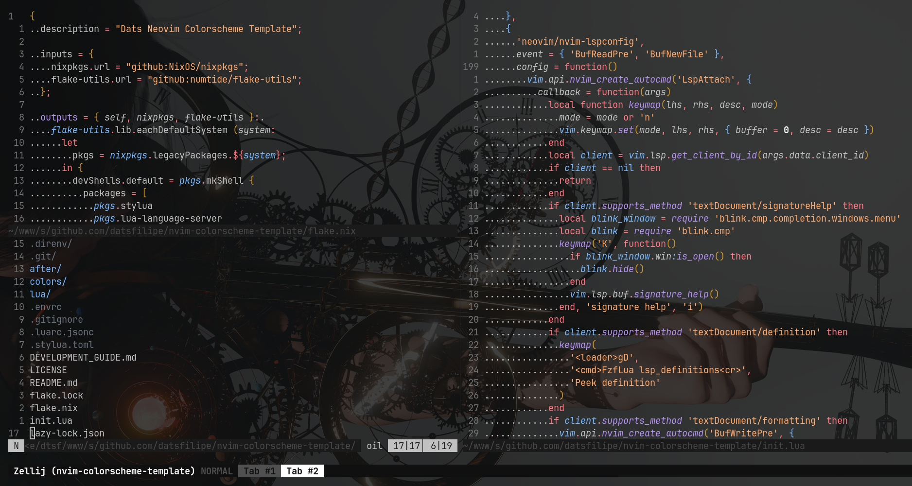

# nyxvamp (neovim)

a minimalist theme collection for Neovim, inspired by a blend of gothic and emo aesthetics with transfem symbolism. it combines deep purples and soft yellows with neutral tones to create strong contrasts and a comfortable coding environment that reflects individuality.

<div align="center">

 

</div>

## variations

1. **veil**: versatile theme for both day and night, featuring bright accents on a dark background.
2. **obsidian**: dark theme for focused nighttime coding sessions.
3. **radiance**: light theme optimized for daylight use, ensuring excellent readability.

## installation

### Using [lazy.nvim](https://github.com/folke/lazy.nvim)

```lua
{
  'zoedsoupe/nyxvamp.nvim',
  priority = 1000, -- ensure it loads first
}
```

### Using [packer.nvim](https://github.com/wbthomason/packer.nvim)

```lua
use 'zoedsoupe/nyxvamp.nvim'
```

### Using [vim-plug](https://github.com/junegunn/vim-plug)

```vim
Plug 'zoedsoupe/nyxvamp.nvim'
```

## usage

### basic setup

```lua
-- set the colorscheme (uses default 'veil' variant)
vim.cmd.colorscheme('nyxvamp')

-- or configure with options
require('nyxvamp').setup({
  variant = 'veil', -- 'radiance' (light), 'veil' (dark), 'obsidian' (very dark)
  transparent = false,
  italics = {
    comments = true,
    keywords = true,
    functions = true,
    strings = true,
    variables = true,
  },
  overrides = {}, -- custom highlight overrides
})

-- then apply the colorscheme
require('nyxvamp').colorscheme()
```

### variant-specific colorschemes

you can also use variant-specific colorschemes directly:

```lua
vim.cmd.colorscheme('nyxvamp-veil')     -- dark variant
vim.cmd.colorscheme('nyxvamp-obsidian') -- very dark variant  
vim.cmd.colorscheme('nyxvamp-radiance') -- light variant
```

## configuration

the following are the **default** configuration options:

```lua
require('nyxvamp').setup({
  variant = 'veil', -- String: 'radiance' (light), 'veil' (dark), 'obsidian' (very dark)
  transparent = false, -- Boolean: Sets the background to transparent
  italics = {
    comments = true, -- Boolean: Italicizes comments
    keywords = true, -- Boolean: Italicizes keywords
    functions = true, -- Boolean: Italicizes functions
    strings = true, -- Boolean: Italicizes strings
    variables = true, -- Boolean: Italicizes variables
  },
  overrides = {}, -- Table or function: Custom highlight group overrides
})
```

### plugin integrations

#### lualine.nvim

```lua
require('lualine').setup {
  options = {
    theme = 'nyxvamp'
  }
}
```

#### bufferline.nvim

```lua
require('bufferline').setup({
  highlights = require('nyxvamp').bufferline.highlights,
})
```

## color palette

### veil (dark)
- background: `#1E1E2E` (dark purple)
- foreground: `#D9E0EE` (light lavender)
- accent: `#F5C2E7` (soft pink)

### obsidian (very dark)
- background: `#000A0F` (near black)
- foreground: `#C0C0CE` (muted gray)
- accent: `#F28FAD` (pink)

### radiance (light)
- background: `#F7F7FF` (off-white)
- foreground: `#1E1E2E` (deep navy)
- accent: `#9655FF` (deep purple)

## contributing

contributions are welcome! if you have suggestions or improvements, feel free to contribute or reach out. please open an issue if you encounter any bug or if you find any improvements are needed for the code, also feel free to open a PR.

## license

[MIT License](LICENSE)
